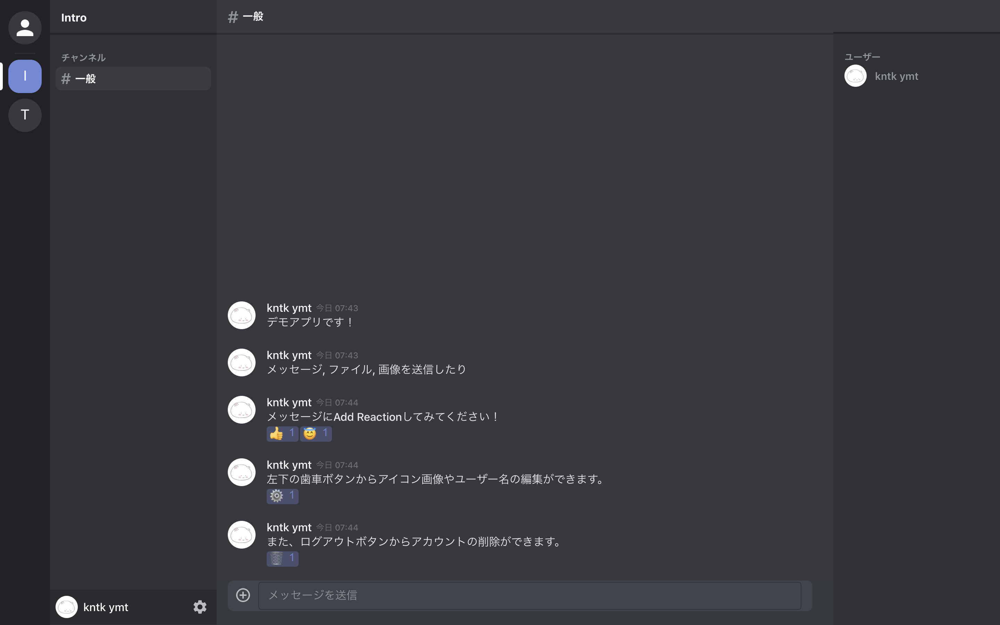

# discord_clone_firebase
## Overview
- [Discord](https://discord.com/) のReact + Firebase製クローンアプリ

## Demo

https://discord-clone-36c89.web.app/

※ ユーザー名の入力が求められますが、「test」等を入力していただければ大丈夫です。

## Setup

本アプリをビルドするためにはFirebaseプロジェクトの設定が必要です。

1. [Firebaseコンソール](https://console.firebase.google.com/?hl=ja)より、プロジェクトを作成します。
1. 作成したプロジェクトにwebアプリケーションを登録します。
1. Firebaseのコンソールで生成した秘密鍵ファイル(.json)を `src/config/firebaseConfig.json` として配置します。
1. `.firebaserc.sample` を参考に `.firebaserc` を作成し、`"your_app_name"` をFirebaseのプロジェクトIDに書き換えます。

以上でセットアップは完了です。

## Develop

### yarn start

アプリを開発モードにてビルドします。
[http://localhost:3000](http://localhost:3000)から確認できます。

### yarn build

アプリを本番モードにてビルドし、build ディレクトリに配置します。

### yarn deploy

build ディレクトリをFirebase Hostingにデプロイします。

### Cors対応について

アプリ内で画像を表示する/ファイルをダウンロードする際、Firebase StorageのCorsの設定によって正常に動作しない場合があります。
 `samplecors.json` 及び以下の記事を参考にFirebase StorageのCorsの設定を行ってください。

[Firebase StorageにCORSの設定をする](https://qiita.com/niusounds/items/383a780d46ee8551e98c)

## License
MIT License
